# Nodo Cívico

> Aplicación móvil Android para **reportes vecinales, seguimiento comunitario y acciones coordinadas de microgestión urbana**.
>
> Los habitantes de un barrio, conjunto residencial, campus o sector pueden registrar incidencias reales de su entorno (alumbrado, aseo, seguridad, servicios públicos), consultar su estado, dar seguimiento a cada caso y coordinar acciones derivadas.


---

## Contexto académico

Proyecto final de la materia **Aplicaciones Móviles**.

- **Institución / programa:** Unidades Tecnologicas de Santander
- **Docente:** GENNER ANDRÉS CARRILLO RUEDA
- **Periodo:** TERCER CORTE
- **Equipo:** Ver sección de los integrantes

> El documento del proyecto está en `docs/Proyecto_Final_de_Aplicaciones_Móviles.pdf`.

---

## Estado del proyecto

| Entregable | Valor | Estado |
|---|---|---|
| **1.** Base funcional y navegación | 20 % | ✅ Entregado |
| **2.** Persistencia y lógica offline (Room, CRUD) | 35 % | ✅ **Entregado** |
| **3.** Integración, receivers y cierre (API REST, BroadcastReceiver) | 45 % | Planeado |

---

## Cobertura del Entregable 1

| Requisito de la rúbrica | Cómo se cumple en este repositorio |
|---|---|
| Proyecto Android creado y organizado | Estructura por capas en `app/src/main/java/com/nodocivico/app/` con paquetes separados `ui/`, `data/`, `api/`, `util/`. |
| Definición del dominio y entidades principales | `data/model/` contiene `Report`, `Category`, `User`, `Reminder`, `FollowUp`, `SyncEvent` y los enums `Priority` y `ReportStatus`. |
| Navegación entre fragments funcionando | `res/navigation/nav_graph.xml` + `MainActivity` con `NavHostFragment` y `BottomNavigationView`. |
| Pantalla inicial, home y al menos dos vistas funcionales enlazadas | Implementadas **7 vistas**: Splash → Home → Lista → Detalle → Crear → Sincronización → Ajustes. |
| Estructura preliminar de la interfaz | Layouts XML en `res/layout/` que reproducen el prototipo HTML de referencia con paleta unificada y componentes Material 3. |
| Primer diseño del contrato de API o esquema JSON | `docs/api_contract.md` con endpoints, schemas JSON y reglas de validación, complementado con `api/ApiContract.kt`. |

> Aunque los criterios piden "al menos dos vistas", el proyecto ya tiene **7 fragments** funcionando. Se hizo así porque ya se deja una base sólida para arrancar con el segundo entregable.

---

## Cobertura del Entregable 2

| Requisito de la rúbrica | Cómo se cumple en este repositorio |
|---|---|
| Base de datos local con Room | `data/local/` con `AppDatabase`, `ReportDao`, `Converters` y `ReportEntity`. Base de datos SQLite gestionada por Room versión 1. |
| Entity, DAO y Repository | `ReportEntity` como `@Entity`, `ReportDao` con operaciones CRUD y queries reactivos con `Flow`, `ReportRepository` como capa de acceso. |
| CRUD completo de la entidad principal | Crear, leer, actualizar estado y editar campos completos del reporte desde los fragments correspondientes. |
| Formularios de creación y edición | `CreateReportFragment` y `EditReportFragment` con campos prellenados, validaciones con `TextInputLayout.error` y Snackbar de confirmación. |
| Listas y detalle con datos reales | `ReportListFragment` consume `Flow<List<Report>>` desde Room vía ViewModel. `ReportDetailFragment` carga el reporte por id con Safe Args. |
| Validaciones básicas | Título mínimo 5 caracteres, descripción mínimo 10, ubicación obligatoria. Errores mostrados inline en cada campo. |
| Estados vacío, carga y error | `ReportListUiState` con tres estados: `Loading`, `Empty` y `Success`. La lista muestra ProgressBar, mensaje vacío o datos según el estado. |
| Evidencia de funcionamiento sin internet | Los reportes se guardan localmente en Room con flag `pendingSync`. La app funciona completamente sin conexión. |
| Más de 8 vistas funcionales | 9 fragments implementados y navegables. |

---

## Fragments implementados (9 en total)

| # | Fragment | Descripción |
|---|---|---|
| 1 | `SplashFragment` | Pantalla de bienvenida con navegación automática |
| 2 | `HomeFragment` | Resumen con contadores reactivos desde Room |
| 3 | `ReportListFragment` | Lista con estados vacío/carga/datos reales |
| 4 | `ReportDetailFragment` | Detalle con Safe Args + actualización de estado |
| 5 | `CreateReportFragment` | Formulario con validación e inserción en Room |
| 6 | `EditReportFragment` | Formulario prellenado con actualización en Room |
| 7 | `CalendarRemindersFragment` | Programación de recordatorios con DatePicker |
| 8 | `SyncStatusFragment` | Panel de sincronización (base para Entregable 3) |
| 9 | `SettingsFragment` | Preferencias de la app |

---

## Stack tecnológico

- **Lenguaje:** Kotlin 1.9.22
- **Build:** Gradle 8.5 (Kotlin DSL) + Android Gradle Plugin 8.2.2
- **SDK:** `compileSdk 34` · `targetSdk 34` · `minSdk 26`
- **UI:** Material 3 (`com.google.android.material:material:1.11.0`)
- **Navegación:** AndroidX Navigation Component 2.7.7 + Safe Args
- **Persistencia:** Room 2.6.1 (`room-runtime`, `room-ktx`, KSP compiler)
- **Arquitectura:** ViewModel + StateFlow/SharedFlow + Repository pattern
- **Otras dependencias activas:** `core-ktx`, `appcompat`, `fragment-ktx`, `recyclerview`, `lifecycle-livedata-ktx`, `core-splashscreen`
- **Dependencias previstas (Entregable 3):** Retrofit/OkHttp, AlarmManager
- **JDK:** 17 (embedded JBR de Android Studio)

---

## Estructura del proyecto

```
NodoCivico/
├── app/
│   └── src/main/
│       ├── AndroidManifest.xml
│       ├── java/com/nodocivico/app/
│       │   ├── NodoCivicoApp.kt               Application — inicializa Room
│       │   ├── MainActivity.kt                NavHost + BottomNavigation
│       │   ├── data/
│       │   │   ├── local/                     Capa Room (Entregable 2)
│       │   │   │   ├── AppDatabase.kt
│       │   │   │   ├── Converters.kt
│       │   │   │   ├── ReportDao.kt
│       │   │   │   └── ReportEntity.kt
│       │   │   ├── model/                     Entidades de dominio
│       │   │   └── repository/
│       │   │       └── ReportRepository.kt
│       │   ├── api/ApiContract.kt             Endpoints planeados
│       │   ├── ui/
│       │   │   ├── splash/
│       │   │   ├── home/
│       │   │   ├── reports/                   List, Detail, Create, Edit, Adapter
│       │   │   ├── reminders/                 CalendarRemindersFragment
│       │   │   ├── sync/
│       │   │   ├── settings/
│       │   │   └── viewmodel/                 ViewModels por feature
│       │   └── util/DateFormats.kt
│       └── res/
│           ├── layout/                        Layouts XML (11 archivos)
│           ├── navigation/nav_graph.xml
│           ├── menu/bottom_nav.xml
│           └── values/
└── docs/
    ├── README.md
    └── api_contract.md
```

---

## Cómo ejecutar el proyecto

### Prerrequisitos

- **Android Studio** Iguana 2023.2.1 o superior
- **JDK 17** (viene embebido con Android Studio)
- **Android SDK 34** instalado vía `Tools → SDK Manager`
- Un emulador o dispositivo físico con **API 26+** (Android 8 o superior)

### Pasos

```bash
git clone https://github.com/Esteban-Codificador/NodoCivico.git
cd NodoCivico
git checkout feature/entregable2
```

Abrir en Android Studio → **Sync Gradle** → **Run**.

---

## Hoja de ruta

### ✅ Entregable 1 — Base funcional y navegación (20 %)
- Proyecto organizado por capas.
- 7 fragments con navegación funcionando.
- Datos en memoria con SampleData.
- Contrato de API documentado.

### ✅ Entregable 2 — Persistencia y lógica offline (35 %)
- Capa `data/local/` con Room completo.
- `ReportRepository` con `Flow<List<Report>>`.
- `ListAdapter + DiffUtil` en el RecyclerView.
- CRUD real desde `CreateReportFragment`, `EditReportFragment` y `ReportDetailFragment`.
- `EditReportFragment` y `CalendarRemindersFragment` como nuevas vistas (total 9 fragments).
- Validación con `TextInputLayout.error`.
- Estados `Loading`, `Empty` y `Success` en la lista.

### Entregable 3 — Integración, receivers y cierre (45 %)
- API REST en Flask siguiendo `docs/api_contract.md`.
- Cliente Retrofit + OkHttp con base URL en `BuildConfig`.
- `SyncManager` con cola de `SyncEvent` y reintentos exponenciales.
- Tres BroadcastReceiver funcionales:
  - `BootReceiver` — reprogramar recordatorios al reiniciar el dispositivo.
  - `ConnectivityReceiver` — disparar sync al recuperar red.
  - `ReminderReceiver` — mostrar notificación local al vencer un recordatorio.
- Indicador visual de conectividad en `HomeFragment` y `SyncStatusFragment`.

---

## Capturas

> Pantallas del Entregable 1 ejecutándose en dispositivo Android (API 26+, build de debug).

<table>
  <tr>
    <td align="center" width="33%">
      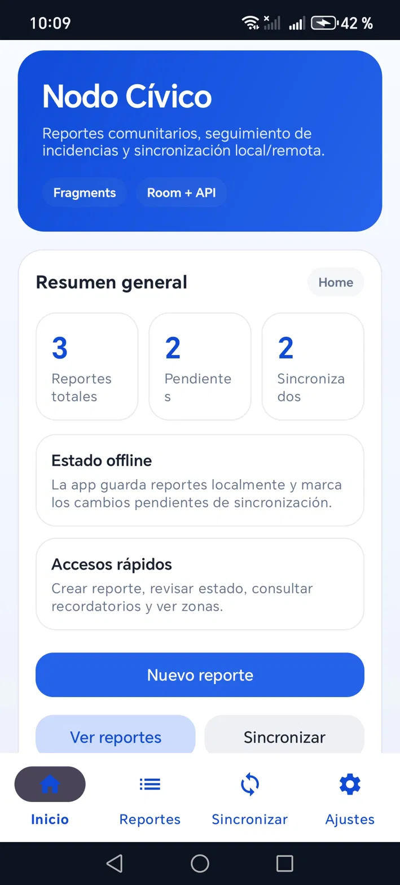
      <br/><sub><b>Inicio</b></sub>
      <br/><sub>Resumen general · estado offline · accesos rápidos</sub>
    </td>
    <td align="center" width="33%">
      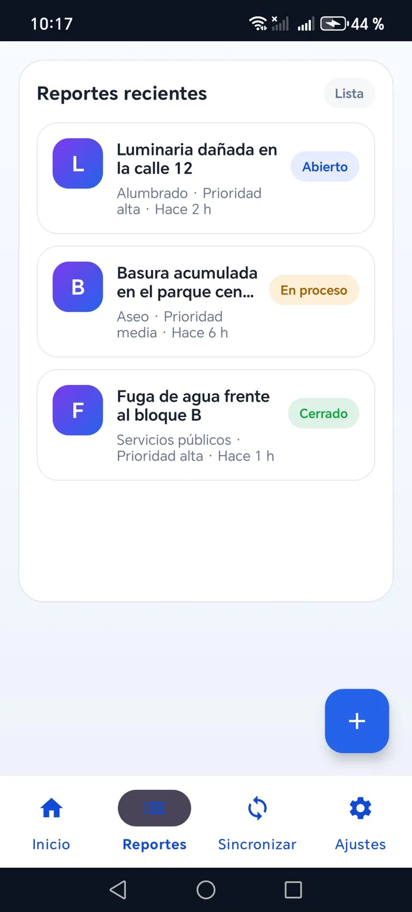
      <br/><sub><b>Reportes recientes</b></sub>
      <br/><sub>RecyclerView con pills de estado y FAB</sub>
    </td>
    <td align="center" width="33%">
      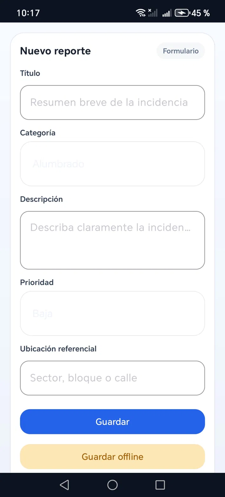
      <br/><sub><b>Nuevo reporte</b></sub>
      <br/><sub>Formulario con validación · guardado offline</sub>
    </td>
  </tr>
  <tr>
    <td align="center" width="33%">
      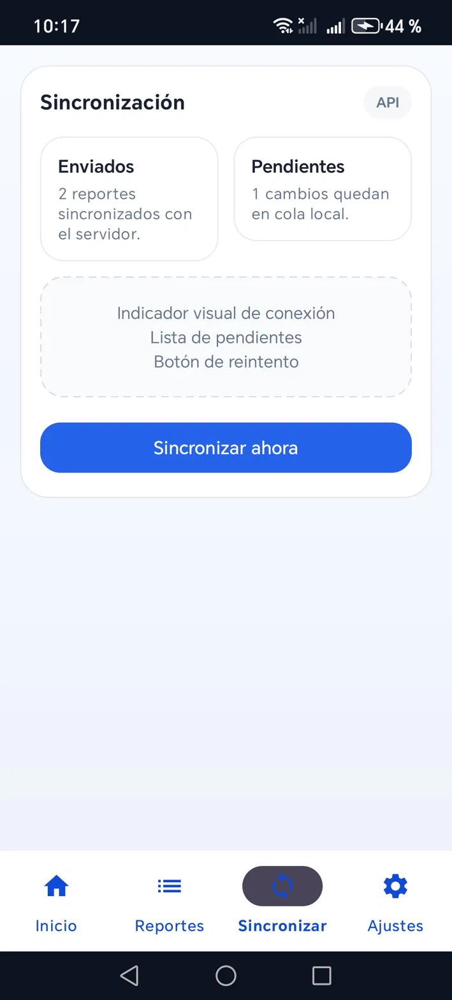
      <br/><sub><b>Sincronización</b></sub>
      <br/><sub>Enviados · cola local · botón de reintento</sub>
    </td>
    <td align="center" width="33%">
      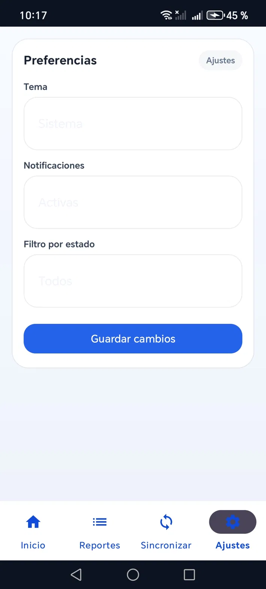
      <br/><sub><b>Ajustes</b></sub>
      <br/><sub>Tema · notificaciones · filtro por estado</sub>
    </td>
    <td width="33%"></td>
  </tr>
</table>

> Pantallas entregable 2 ejecutándose en el dispositivo Android.

<table>
  <tr>
    <td align="center" width="33%">
      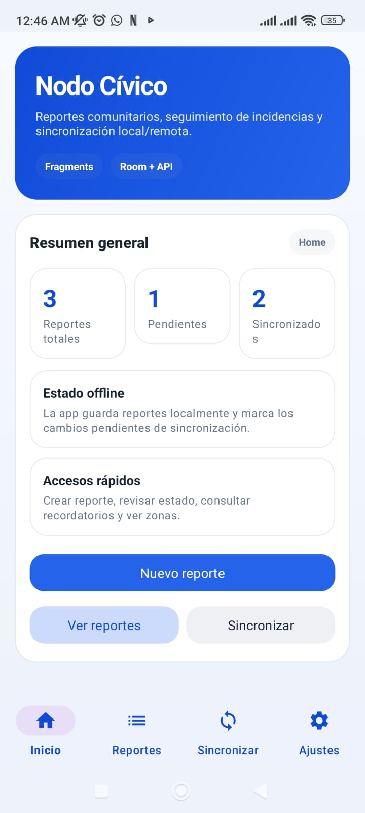
      <br/><sub><b>Home</b></sub>
    </td>
    <td align="center" width="33%">
      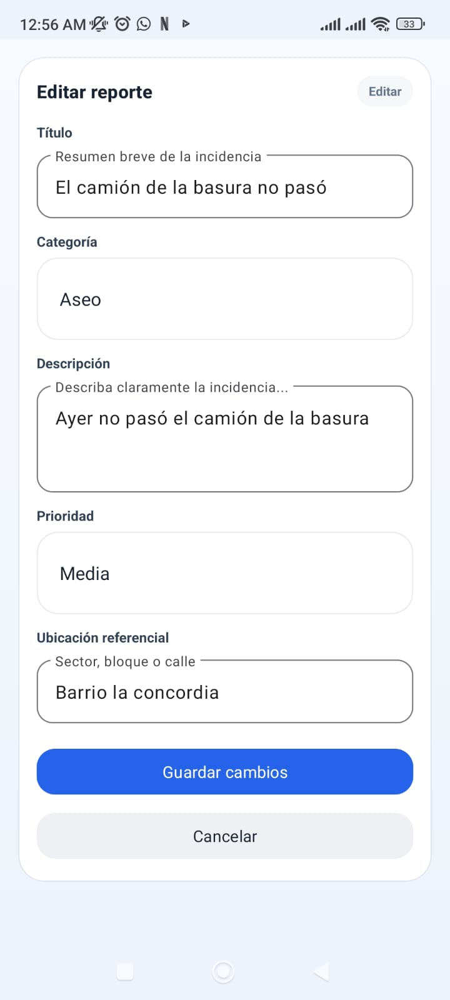
      <br/><sub><b>Crear reportes</b></sub>
    </td>
    <td align="center" width="33%">
      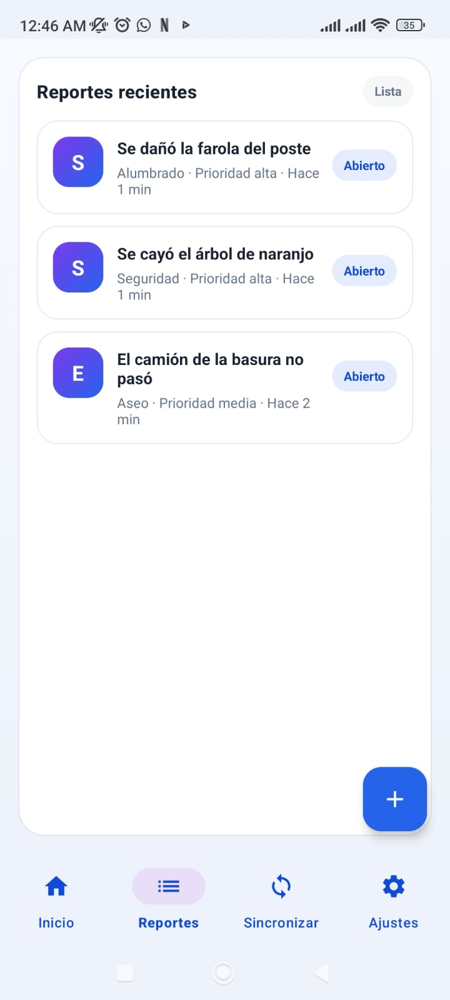
      <br/><sub><b>Lista de reportes</b></sub>
    </td>
  </tr>

  <tr>
    <td align="center" width="33%">
      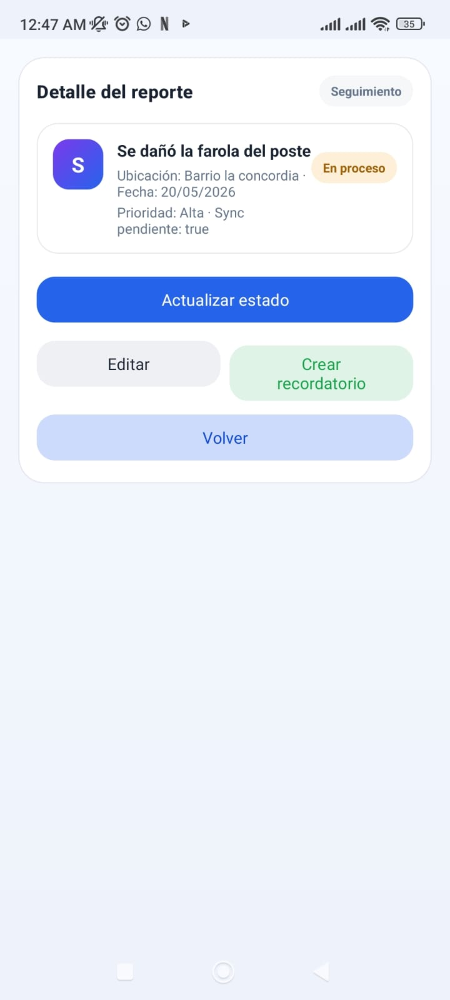
      <br/><sub><b>Actualizar estado</b></sub>
    </td>
    <td align="center" width="33%">
      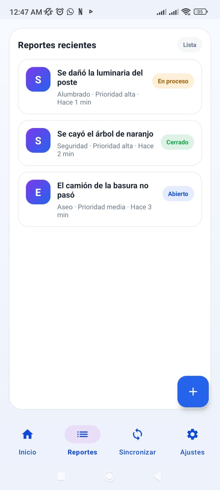
      <br/><sub><b>Listado de reportes por estado</b></sub>
    </td>
    <td align="center" width="33%">
      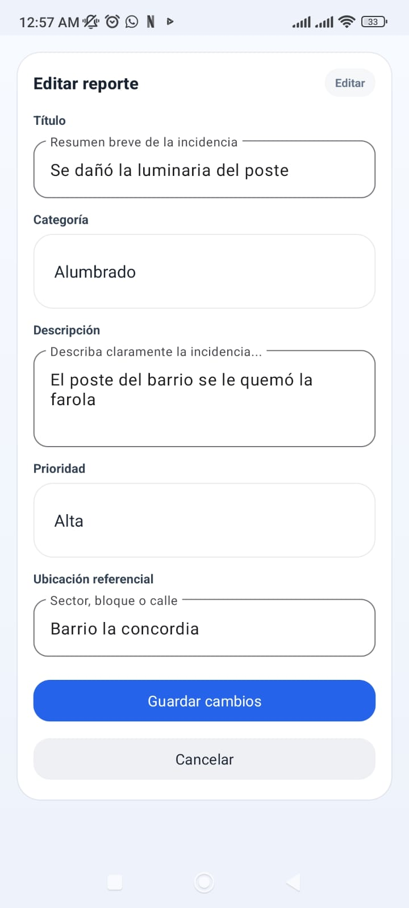
      <br/><sub><b>Editar reporte</b></sub>
    </td>
  </tr>

  <tr>
    <td align="center" width="33%">
      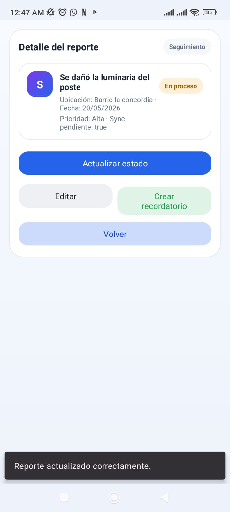
      <br/><sub><b>Reporte actualizado</b></sub>
    </td>
    <td align="center" width="33%">
      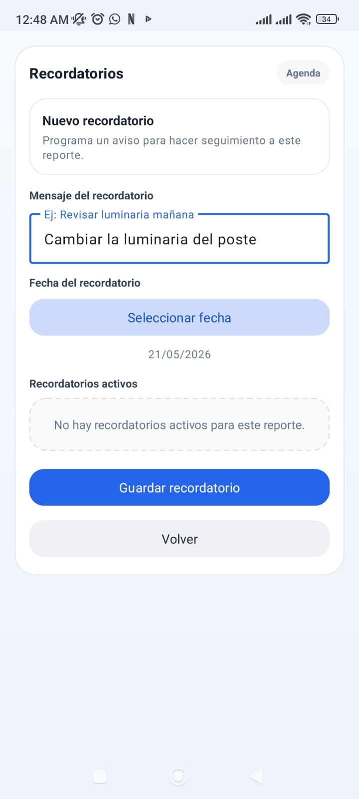
      <br/><sub><b>Crear recordatorio</b></sub>
    </td>
    <td align="center" width="33%">
      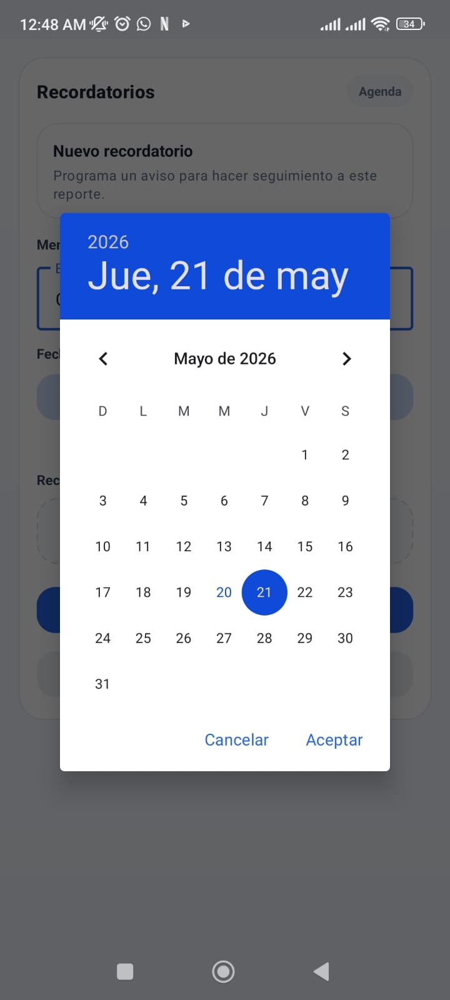
      <br/><sub><b>Calendario</b></sub>
    </td>
  </tr>

  <tr>
    <td align="center" width="33%">
      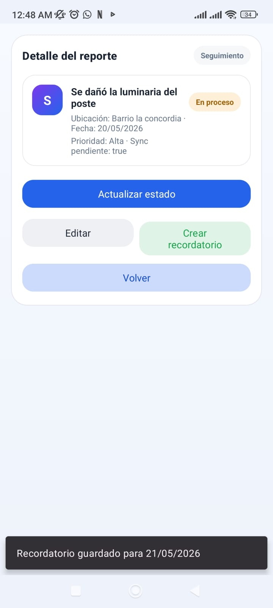
      <br/><sub><b>Recordatorio guardado</b></sub>
    </td>
    <td width="33%"></td>
    <td width="33%"></td>
  </tr>
</table>

---

## Autores

| Nombre | Rol | Contacto |
|---|---|---|
| Esteban Alberto Avila Corredor | Estudiante | eaavila@uts.edu.co / https://github.com/Esteban-Codificador |
| Juan Sebastian Ropero Amado | Estudiante | jsropero@uts.edu.co / https://github.com/JuanSebastian1228 |
| Ariana Alexandra Duran Grimaldos | Estudiante | Aalexandraduran@uts.edu.co / https://github.com/Arianaduran25 |